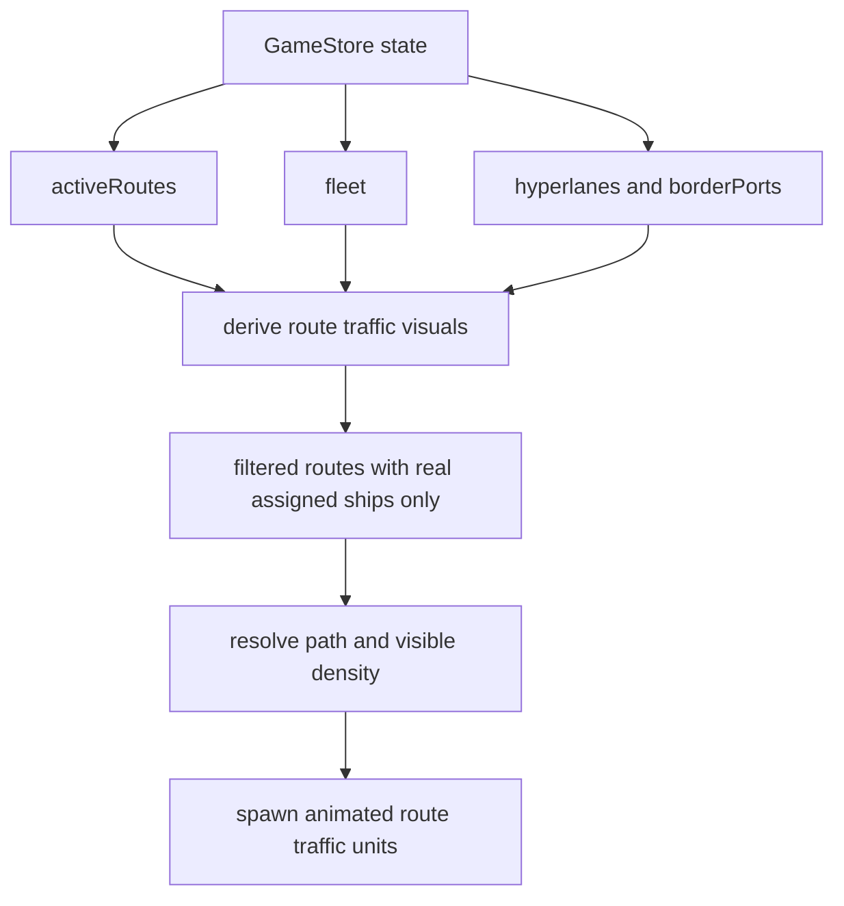

# Galaxy Route Traffic Implementation Plan

## Goal

Update galaxy-screen ship motion so visible route traffic is derived from real route assignments instead of ambient or synthetic route markers.

## Relevant files and systems

- `src/scenes/GalaxyMapScene.ts`
  - Renders active route overlays and animated route traffic.
  - Currently creates one visible mover per active route using the first assigned ship when available.
  - Also creates separate ambient wanderer ships unrelated to player route assignments.
- `src/game/routes/RouteManager.ts`
  - Owns route creation and assignment utilities.
  - `createRoute` starts with an empty `assignedShipIds` list.
  - `assignShipToRoute`, `unassignShip`, and `deleteRoute` already maintain route assignment state.
- `src/ui/RouteBuilderPanel.ts`
  - Creates routes and optionally assigns or auto-buys a ship at creation time.
  - Updates store state through `gameStore.update`.
- `src/scenes/RoutesScene.ts`
  - Assigns ships to routes, deletes routes, and refreshes route UI.
  - Also writes route and fleet updates through `gameStore.update`.
- `src/data/GameStore.ts`
  - Emits `stateChanged` on `update` and `setState`.
  - Does not currently emit per-key change events for `setState`.
- `src/data/types.ts`
  - `ActiveRoute.assignedShipIds` and `Ship.assignedRouteId` provide the existing source of truth.

## Current behavior

### Route traffic in the galaxy scene

- `GalaxyMapScene` draws route lines for each active route.
- It then creates exactly one animated ship for that route.
- If the route has assigned ships, the scene uses only the first assigned ship to choose sprite class and tint.
- If the route has no assigned ships, the scene still renders a fallback moving pip on that route.

### Ambient traffic outside route assignments

- `GalaxyMapScene` separately spawns up to five wandering ships across accessible systems.
- Those ships are not derived from route assignments.

## Likely mismatch with desired behavior

1. **Starting-game traffic mismatch**
   - New games correctly start with no active routes and no route assignments, but galaxy traffic can still appear because ambient wanderers are always eligible to spawn and route pips appear for unassigned routes.
2. **Assignment mismatch**
   - Visible route traffic is not tied to actual assigned ships one-to-one or even ship-count-to-density.
   - A route with three assigned ships still shows only one mover.
3. **Empty-route mismatch**
   - Unassigned routes still show movement because of the fallback pip.
4. **Dynamic update risk**
   - Route and fleet data are updated through the store, but `GalaxyMapScene` currently has no visible subscription or rebuild mechanism tied to route and assignment changes while the scene remains open.
5. **Late-game scaling mismatch**
   - Traffic volume is capped by route count plus a fixed ambient wanderer count rather than by actual network assignments.

## Planning assumption adopted for this plan

- Use **aggregated traffic per route segment**, not strict one-marker-per-assigned-ship rendering.
- The source data should still be real assigned ships, but the visible representation may compress that data into route-level or segment-level traffic density for readability.

## Proposed target model

### Source of truth

Continue using existing game state only:

- `ActiveRoute.assignedShipIds`
- `Ship.assignedRouteId`

No parallel persisted visual-traffic state is needed.

### Derived visual traffic model

Add a derived, scene-local traffic builder that converts current game state into renderable traffic entries.

Recommended shape:

```ts
type RouteTrafficVisual = {
  routeId: string;
  pathSystemIds: string[];
  assignedShips: Ship[];
  visibleUnits: number;
  visualClassMix: ShipClass[];
};
```

The derivation rules should be:

1. Start from `state.activeRoutes`.
2. Exclude any route with `assignedShipIds.length === 0`.
3. Resolve assigned ship IDs to actual `Ship` records from `state.fleet`.
4. Discard orphaned IDs that have no matching fleet ship.
5. If the resolved assigned ship list is empty, produce no visual traffic for that route.
6. Resolve the hyperlane path once for the route.
7. Convert assigned-ship count into a visible density number.

### Aggregation rule for visible units

Use a deterministic density mapping derived from actual assigned ship count, for example:

- 1 assigned ship → 1 moving unit
- 2 to 3 assigned ships → 2 moving units
- 4 to 6 assigned ships → 3 moving units
- 7 or more assigned ships → 4 moving units

This preserves the requested progression:

- no assigned ships means no traffic,
- more assigned ships means more visible traffic,
- late game becomes busier naturally,
- rendering remains readable on crowded corridors.

### Sprite-class selection under aggregation

For each visible unit, choose its sprite from the assigned ships on that route instead of always the first ship.

Recommended approach:

- Build a stable ordered list of assigned ships.
- For each visible unit index, choose a ship by cycling through that list.
- This keeps mixed fleets visually representative without needing one sprite per ship.

## Proposed data flow



## Scene and update-hook plan

### 1. Separate route-derived traffic from ambient traffic in `GalaxyMapScene`

Refactor the route-traffic block into helper functions inside `src/scenes/GalaxyMapScene.ts`:

- `buildRouteTrafficVisuals`
- `createRouteTrafficLayer`
- `destroyRouteTrafficLayer`
- `refreshRouteTrafficLayer`

Keep route-line rendering and moving sprites in the same owned container or layer so the entire traffic presentation can be destroyed and rebuilt cleanly.

### 2. Remove non-route ambient wanderers from the galaxy traffic model

The ambient wanderer block should be removed or disabled for the galaxy map if the goal is that visible route traffic reflects actual assigned route ships.

If some background life is still desired later, it should be explicitly separated as non-route ambience and visually subdued, but this request should treat visible traffic on routes as assignment-driven only.

### 3. Subscribe the scene to store changes

Add a lightweight subscription in `GalaxyMapScene` to `gameStore` `stateChanged` so route traffic refreshes while the player remains on the galaxy screen.

Recommended behavior:

- On create, register a listener.
- On shutdown or destroy, unregister the listener.
- In the listener, compare the new route-traffic-relevant state and rebuild only when one of these changes:
  - `activeRoutes`
  - `fleet`
  - `hyperlanes`
  - `borderPorts`
  - possibly empire accessibility inputs if path availability depends on them

Since the current store `setState` only emits `stateChanged`, that event is the safest hook to rely on.

### 4. Prefer full traffic-layer rebuild over incremental patching

For this feature, a full rebuild is simpler and less error-prone than trying to diff individual route assignments.

Why this is the right evolution path:

- route counts are manageable,
- animations already use autonomous tweens and delayed callbacks,
- route deletion, reassignment, and path changes all become easy to handle consistently,
- it avoids stale tweens for removed routes.

Implementation detail for the later coding pass:

- Store route graphics, sprites, and timers in one dedicated container or tracked collection.
- On refresh, destroy the old collection before building the new one.

## Concrete behavior rules to implement

### No starting traffic

Achieved by combining these rules:

- new games start with `activeRoutes: []`,
- route visuals are only derived from routes with real assigned ships,
- no fallback moving pip is rendered for unassigned routes,
- no unrelated ambient wanderer traffic is spawned.

### Dynamic appearance and disappearance

Traffic appears when:

- a route is created and gains a real assigned ship in `RouteBuilderPanel`, or
- a ship is assigned later in `RoutesScene`.

Traffic disappears when:

- a ship is unassigned so a route resolves to zero actual assigned ships,
- a route is deleted,
- path resolution fails and the design chooses to suppress movement rather than fake it,
- fleet-route references become orphaned and resolve to zero ships.

### More late-game traffic

This falls out of the aggregation rule automatically:

- more routes with assigned ships create more route traffic entries,
- more ships assigned to a given route raise `visibleUnits`,
- larger player networks therefore look busier without a hand-authored cap unrelated to state.

## File-by-file implementation guidance

### `src/scenes/GalaxyMapScene.ts`

Primary work item.

Planned changes:

- Replace the current one-ship-per-route rendering logic with a route-traffic derivation pass based on resolved assigned ships.
- Remove the fallback pip for unassigned routes.
- Remove or disable ambient wandering ships for this scene.
- Add a refreshable traffic layer and state-change listener.
- Preserve existing hyperlane path traversal logic and patrol behavior rather than replacing it wholesale.

### `src/game/routes/RouteManager.ts`

Likely no behavior changes required.

Possible optional addition:

- add a pure helper to resolve valid assigned ships per route if the coder wants derivation logic shared between scenes and tests.

This should remain optional because the current request is presentation-driven, and keeping the first iteration scene-local minimizes scope.

### `src/ui/RouteBuilderPanel.ts`

No direct behavior change required.

Its existing `gameStore.update` call should already trigger galaxy traffic refresh once the galaxy scene listens for state changes.

### `src/scenes/RoutesScene.ts`

No direct behavior change required for route traffic logic.

Its existing route assignment and deletion flows already update the store. The main follow-on need is ensuring those updates are observed by the galaxy scene.

### `src/data/GameStore.ts`

Probably no required change.

Optional hardening improvement:

- make `setState` emit per-key changed events similar to `update`.

That is not necessary if the galaxy scene listens only to `stateChanged`.

## Edge cases to handle explicitly

1. **Assigned ship IDs missing from fleet**
   - Do not render synthetic traffic from broken references.
2. **Routes with no hyperlane path**
   - Keep the current straight-line fallback only if design wants persistent visibility despite access issues.
   - If the intent is realism, suppress movement for inaccessible routes and optionally still draw the route line.
   - The coding pass should make a deliberate choice here and document it.
3. **Multiple ships on the same route**
   - Offset phase, start delay, or travel position so aggregated movers do not overlap perfectly.
4. **Scene refresh churn**
   - Rebuild only on relevant state changes if needed, but correctness is more important than micro-optimization in the first pass.

## Recommended tests and validations

### Unit-level or pure-function tests

If derivation logic is extracted into a helper:

- returns no visuals for empty `activeRoutes`
- returns no visuals for routes with empty `assignedShipIds`
- ignores orphaned assigned IDs not found in fleet
- increases `visibleUnits` as assigned ship count grows
- chooses stable ship-class sampling from the assigned fleet list

### Scene-level validation checklist

Manual or integration validation should confirm:

1. New game opens to galaxy map with no moving route traffic.
2. Creating a route without assigning a ship shows a route line but no moving ship traffic.
3. Creating a route with an assigned ship immediately shows route traffic.
4. Assigning a ship later in `RoutesScene` causes traffic to appear without needing a full scene reload.
5. Deleting a route removes its traffic immediately.
6. Adding more ships to an existing route visibly increases route traffic density.
7. Late-game saves with many assigned ships show more traffic than early-game saves.
8. Broken route references do not create phantom ships.

### Regression checks

- Existing route line rendering still follows hyperlane paths.
- Sprite selection still works for all ship classes supported by `ShipMapSprites`.
- Scene cleanup does not leave orphaned tweens or delayed callbacks after switching scenes.

## Execution order for code mode

1. Refactor route-traffic rendering in `GalaxyMapScene` into a dedicated refreshable layer.
2. Change route derivation so only routes with resolved assigned ships produce moving traffic.
3. Replace one-route-one-mover logic with aggregated density derived from assigned ship count.
4. Remove fallback unassigned-route pips.
5. Remove or disable ambient wanderer traffic in the galaxy scene.
6. Hook the scene into `gameStore` `stateChanged` and rebuild traffic on relevant changes.
7. Add tests for any extracted derivation helper and run manual validation on route add, assign, unassign, delete, and late-game scenarios.

## Recommendation

Implement this as an evolution of the current `GalaxyMapScene` path-following logic, not a rewrite. The hyperlane pathing and patrol animation are already aligned with the intended direction; the missing piece is making the renderer derive what to show from real route assignment state.
